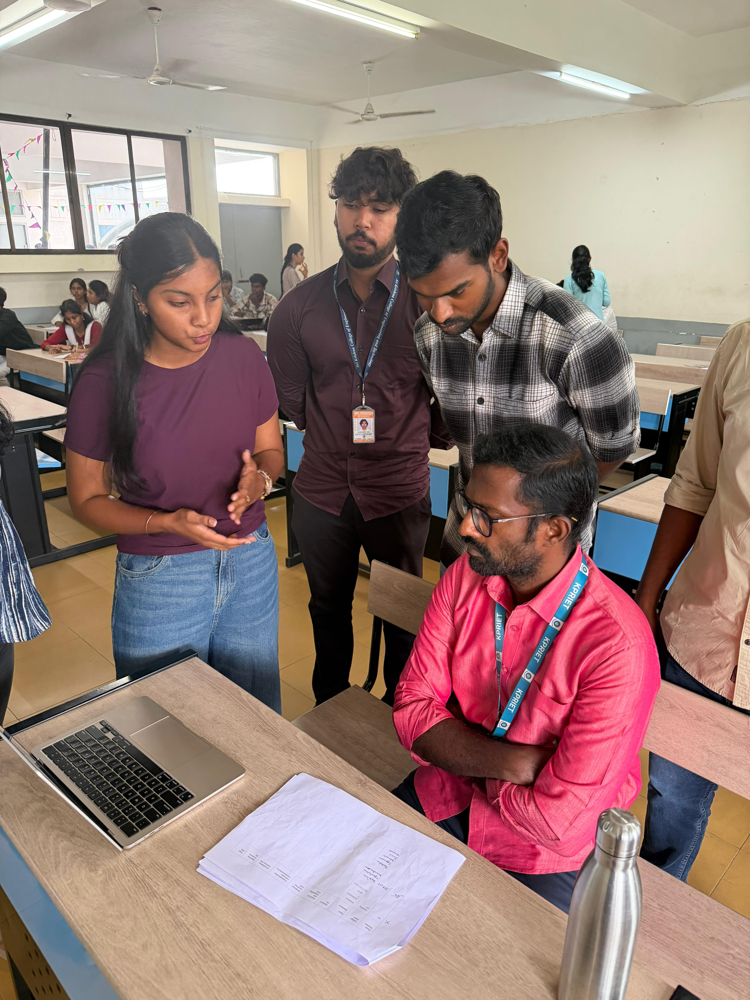
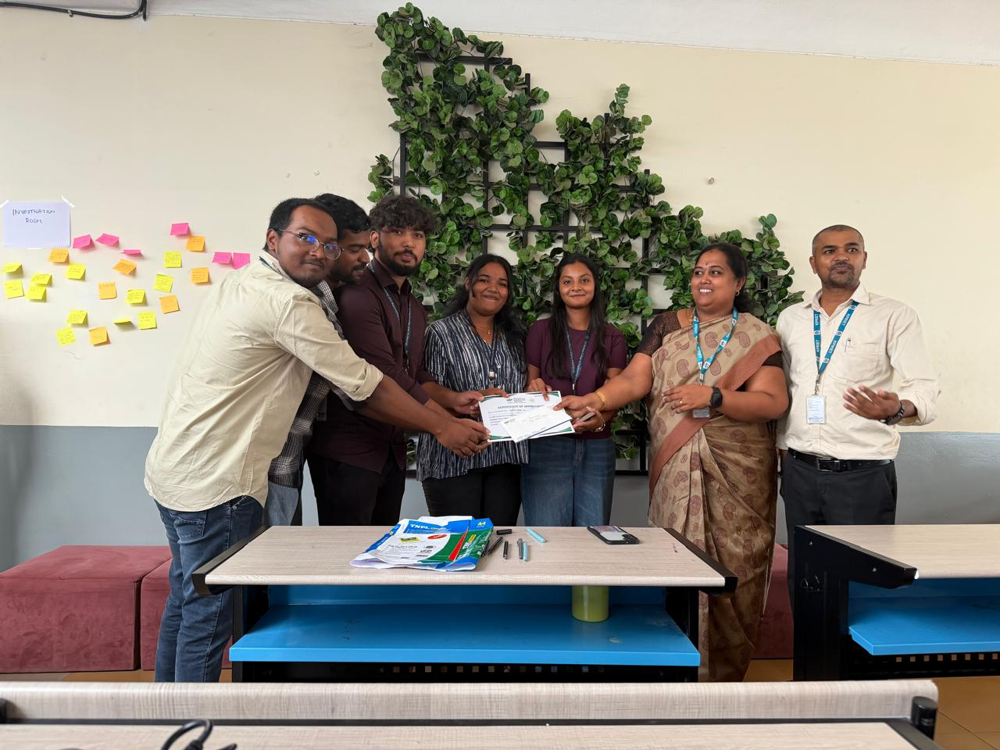
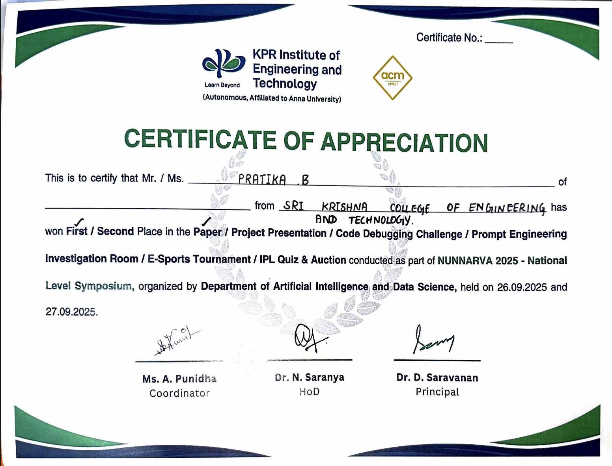

# 📅 ACADSYNC – Smart Timetable Automation System

<div align="center">
  
  
  
  
</div>

---

## 🔗 Quick Links

- 💻 GitHub: [View Here](https://github.com/Pratika17/hermes)
- 📄 Presentation: [Watch Here](https://youtu.be/n15af-XqCaU)

---

## 🎓 Overview

AcadSync is an intelligent academic scheduling platform designed to eliminate the inefficiencies of manual timetable creation.

Traditional timetable planning involves:
- Time-consuming manual effort  
- Frequent scheduling conflicts  
- Complex coordination between teachers and departments  

AcadSync solves this by providing a **fully automated, conflict-free timetable generation system**.

---

## 🏆 Achievement

### 🥇 KPR Institute Paper Presentation – Winner (2024)

<p align="center">
  
  
  
</p>

- Secured **1st place among 200+ participants**  
- Presented research on **AcadSync**  
- Evaluated on:
  - Technical depth  
  - Research clarity  
  - Presentation skills  
- Competed against students from multiple engineering institutions  

---

## ✨ Core Features

### ⚙️ Automatic Timetable Generation
- Generates complete timetables instantly  
- Eliminates manual scheduling effort  

### 🚫 Conflict-Free Scheduling
- Prevents clashes in:
  - Teachers  
  - Classrooms  
  - Subjects  

### 🧠 Smart Allocation System
- Optimally assigns teachers, rooms, and time slots  
- Ensures efficient resource utilization  

### 🔄 Easy Updates & Modifications
- Modify schedules with minimal effort  
- Changes reflect instantly  

### 📊 Centralized Management
- All timetables managed in one platform  
- Better coordination across departments  

### 🤝 Reduced Communication Overhead
- Minimizes back-and-forth between staff  
- Streamlined scheduling process  

---

## 🎯 System Impact

- 👩‍🏫 Teachers save time and reduce workload  
- 🏫 Institutions achieve better schedule management  
- 📅 Scheduling becomes faster, accurate, and efficient  

> “From Manual Scheduling to Smart Automation”

---

## 🏗️ Architecture

### 🛠️ Tech Stack

- **Frontend:** Flutter (Dart)  
- **Backend:** *(Add if used)*  
- **Database:** *(Add if used)*  
- **State Management:** *(Provider / Riverpod / etc.)*  

---

## 📂 Project Structure

```

lib/
├── models/
├── services/
├── providers/
├── screens/
├── utils/
└── main.dart

````

---

## 📱 User Flow

### 👩‍🏫 Teachers / Admin

1. Input subjects, teachers, and constraints  
2. Generate timetable automatically  
3. Review and adjust if needed  
4. Publish schedule  

---

## 🚀 Getting Started

```bash
# Clone the repository
git clone https://github.com/Pratika17/hermes.git

# Navigate into project
cd acadsync

# Install dependencies
flutter pub get

# Run the app
flutter run
````

---

## 🔍 Use Cases

* School and college timetable automation
* Department-level scheduling
* Academic planning systems
* Institutional resource allocation

---

## 🚀 Future Enhancements

* AI-based timetable optimization
* Faculty availability prediction
* Integration with attendance systems
* Cloud sync and multi-user collaboration
* Analytics dashboard

---

## 🤝 Contribution

1. Fork the repo
2. Create a branch (`feature/your-feature`)
3. Commit changes
4. Push and open a PR

---

## 📜 License

MIT License

---

## 👩‍💻 Author

**Pratika Baburaj**

* GitHub: [https://github.com/Pratika17](https://github.com/Pratika17)
* LinkedIn: [https://linkedin.com/in/pratikababuraj](https://linkedin.com/in/pratikababuraj)

---

<div align="center">
  <p><strong>Making academic scheduling smarter and effortless 📅</strong></p>
</div>
